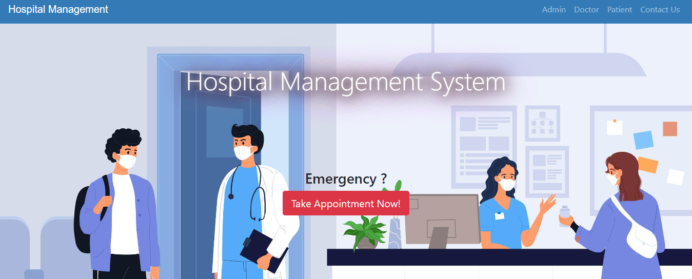

# Next Gen Hospital 💊🥼

This capstone project comes with differnet functionalities including:

1. Patient, Doctor, and Admin panels provide distinct functionalities tailored to their roles, including appointment management, billing, and administrative tasks.
2. Patients can book appointments based on their requirements, while administrators oversee the process and approve appointment requests which includes create, manage, and updation of the appointments.
3. The system automates billing processes, generates bills based on services rendered, and facilitates patient discharge upon approval.

# Preview

<table>
  <tr >
    

        
    

  </tr>
</table>

<h1 align="center">⚡Connect with me⚡</h1>

   
	

